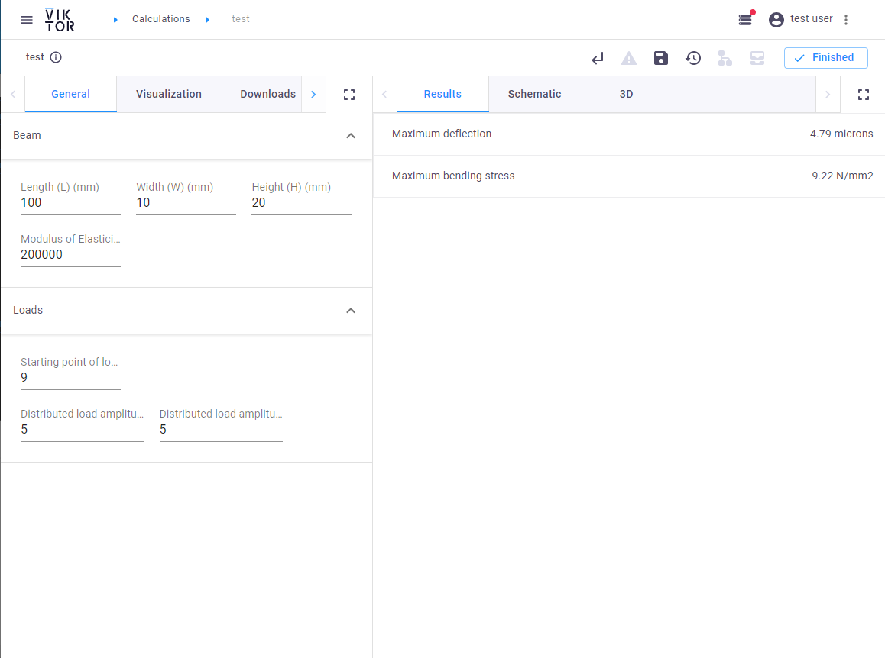
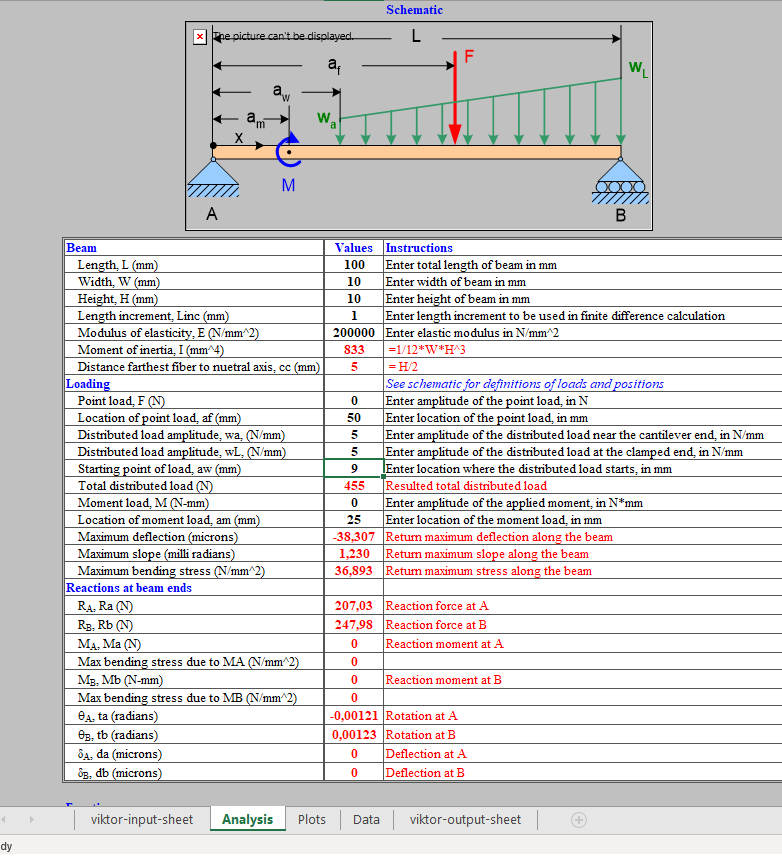

 <Please check version is the same as specified in requirements.txt>

# Using a calculation spreadsheet
This sample app will create an application to calculate a simply supported beam under load. 
A spreadsheet will be used for the calculations.

A full tutorial for this app can be found [here.](https://docs.viktor.ai/docs/guides/tutorials/calculation-spreadsheet)

To run this code, you will need a VIKTOR licence, which you can access using our [free version](https://www.viktor.ai/try-for-free).

This is an overview of the forces in the example:

Here you can see the input parameters on the left. And the calculated results on the right:

This is the tab in the spreadsheet where the analysis is done:

