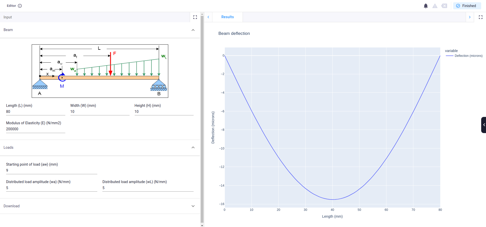

# Using a calculation spreadsheet
This application shows how to connect an Excel spreadsheet to perform calculations. In this
example a simply supported beam under load is analyzed.

A full tutorial for this app can be found [here.](https://docs.viktor.ai/docs/getting-started/tutorials/spreadsheet-calculator-tutorial/)

To run this code, you will need a VIKTOR account, which you can access using our [free version](https://www.viktor.ai/try-for-free).

A user can specify the dimensions of the beam and the applied loads. In the spreadsheet the
following plots are automatically generated:

- Deflection
- Moment distribution
- Stress distribution
- Shear force distribution

As an example, the Deflection plot is extracted and shown to the user, however this can easily
be updated to any plot of interest!

